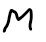

以下 <TARGET_PLATFORM> 表示RK3566_RK3568或RK3588。  
 **系统是ubuntu或者Debian，板子需要接入互联网**

# rknn模型来源说明
rknn模型来源于自己训练的识别a_z手写字体的模型。

## 连接板端
ssh 用户名@板端IP
```
# 以泰山派为例
ssh linaro@192.168.2.100
```

## 准备工作

1. 需要在板端安装编译的工具
```
sudo apt-get install -y gcc g++ cmake git make
```
2. 克隆代码
```
git clone https://github.com/xioqishiJun/rknn_cnn_demo.git
```

## 编译

```
cd rknn_cnn_demo
mkdir build && cd build
cmake ..
make -j 4
```

## 运行
```
./rknn_cnn_demo
```
正常的话会显示下面的结果,图片是一个手写字母，识别正确


```
model input num: 1, output num: 1
rknn_run
The results are
0.00765228 0.00229454 0.000376701 8.35657e-05 6.13928e-06 2.5034e-06 0.000228047 0.0103531 3.57628e-07 0.000102162 0.00025177 7.54595e-05 0.949219 0.0126419 0.00187683 0.00566483 0.000102162 0.00512314 0.000760078 0.00102806 0.000929356 9.2268e-05 0.000688076 0.000186443 0.000340223 1.01328e-05 
The letter with the highest score is: M
```
